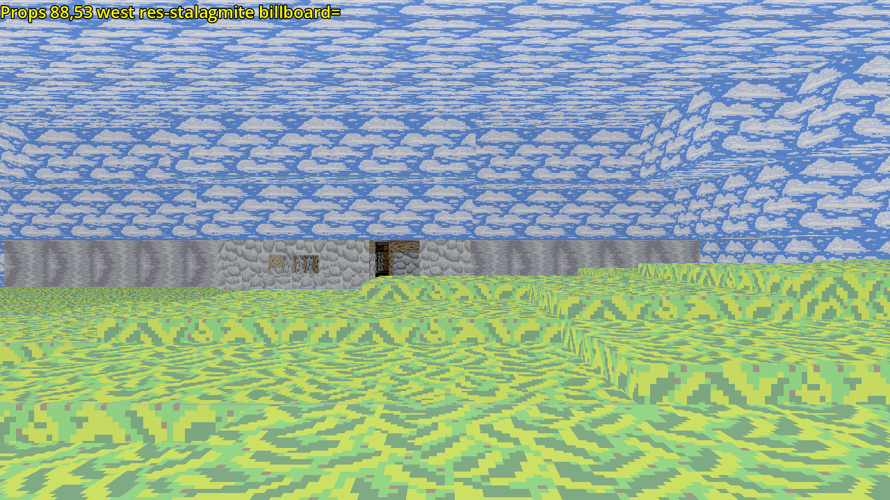

3D Dungeon Test
===============

Description
-----------
This is a visual test/demonstration/mockup of those 4 directional 3D
perspective dungeon crawler style games, except this does actually use 3D
because that's just easier and more efficient on modern computers.  It also
supports tinting surfaces and blending between the top and bottom of wall
textures, as well as variable height ceilings and floors.

Screenshots
-----------





Controls
--------
### General
```
W, S, A, D - move forward/back, strafe left/right
Q, E - turn counter clockwise/clockwise
F6 - Toggle play/edit mode
```

### Play
no additional controls

### All Editors
```
Tab - cycle editor modes (Terrain, Props, Events)
Shift - fast modify value +, cycle backwards *, alternate function
Ctrl - slow modify value +
Z, X - Raise and lower view height, normally 1/10 of a block.  Holding shift
       will raise or lower by a whole block and control will raise or lower by
       1/100th.
F5 - Save map data to file.  A prompt for a name will come up.  It will be
     saved to this game's user storage location.
F8 - Load map data from file.  A prompt for a name will come up.  It loads
     from this game's user storage location.
```

### Terrain Editor
Status bar will show mode `Terra`, your present coordinates, facing direction,
whether the top or bottom mesh is selected, whether a horizontal face or a wall
is selected and the current parameter.

```
C - Toggle between attaching to ceiling or floor.  When moving, the distance
    will remain constant with the selected face in whatever cell is moved to.
U - cycle between "ceiling" and "floor" mesh
    for bias or hue, this affects the face that's shown in the default
    arrangement of the ceiling mesh being above the floor mesh
        ceiling - changes bottoms of both
        floor - changes tops of both
I - cycle between wall (vertical) or horizontal faces
O - cycle between top or bottom face or the top or bottom part of the wall
    this affects height and texture offset
P - cycle between parameters *
    height - Y position of the selected face
    hue - hue from 0.0 and 1.0
          0.0 is white, then red yellow green cyan blue purple
    bias - 1.0 no change in brightness
           < 1.0 darken by multiplying
           > 1.0 brighten by addition (desaturate)
    offset - texture offset in texture strip.  each 1.0x is 1 width unit going
             down
    fog color r
    fog color g
    fog color b - color of distance fog
    fog power - power the fog intensity is raised to
J, K - decrease/increase parameter.  Parameters will be increased or decreased
       by default at some "sensible" rate, usually 0.1, except offset which is
       by 1/8 by default.  Holding shift will change all values by 1.0 and
       control will change values by some slower sensible rate, typically
       except offset which is 1/64. +
M - Capture value of currently selected parameter.  Hold shift to apply a
    captured value.
L - Enter/change the captured value which would be used directly.
Y - Capture ceiling wall hues, biases and offset values.  Hold shift to apply
    the captured values.
H - Capture selected horizontal face (ceiling or floor) hue, bias and offset
    value.  Hold shift to apply.
N - Capture floor wall hues, biases and offset values.  Hold shift to apply.
B - Capture height values of ceiling and floor mesh tops and bottoms.  Hold
    shift to apply.
```
All modified values will be relative to the horizontal faces in the
neighboring cell which is in the direction being looked at and walls which
are on the side directly on that neighboring cell facing the view.

### Props Editor
Status bar will show mode `Props`, your present coordinates, facing direction,
the current selected prop with a prefix indicating where it's from: `res` for
built in resources, `user` for user overrides, `map` for map provided and
`mapuser` for user overrides for map provided resources.  Next if there are any,
the selected placed prop in the cell, then finally the currently selected
parameter.

```
P - place prop
J, L - move prop left, right +
I, K - move prop away, towards +
N, M - move prop down, up +
U, O - rotate prop counter clockwise, clockwise +
Y - cycle prop definition to place *
H - cycle prop selection in cell *
B - cycle prop parameter *
    billboard - sprite always faces camera
    one-sided - sprite is only visible from one side, transparent through the
                other
    attachment - whether sprite is attached to the ceiling or floor movement
    horizontal mode - sprite lays flat on the ground
    horizontal scale
    vertical scale - sprite scale
    color mod r
    color mod g
    color mod b
    color mod a - color modulation (multiplication, 1.0 - not modified,
                                                    <1.0 - darker,
                                                    >1.0 - brighter)
    position x
    position y
    position z - sprite position in cell, this is the same as the "move prop"
                 keys change, just useful for capturing/setting
    angle - sprite angle in radians, this is the same as the "rotate prop" keys
            change, just useful for capturing/setting
G, T - decrease, increase selected parameter +
V - Capture value of currently selected parameter.  Hold shift to apply a
    captured value.
F - Enter/change the captured value which would be used directly.
```
